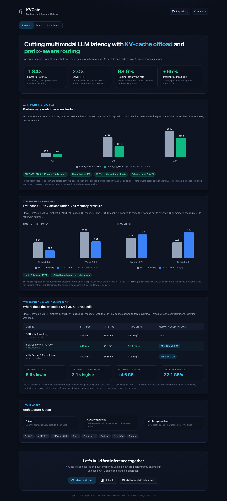
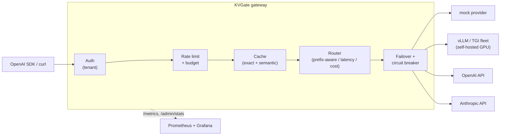

<div align="center">

# KVGate

**Multimodal LLM inference gateway with KV-cache-aware routing and offload.**

[](https://github.com/rishika7006/kvgate/actions/workflows/ci.yml)
[](https://www.python.org/)
[](LICENSE)
[](https://github.com/astral-sh/ruff)

**[Live demo](https://kvgate.vercel.app)** · **[Benchmark report](docs/BENCHMARK_REPORT.md)**

</div>

KVGate is an open-source, OpenAI-compatible gateway that sits in front of a fleet of vLLM
replicas. Unlike provider-aggregation proxies, it works at the KV-cache layer: it routes each
request to the replica that already holds its prefix (including the image bytes) warm, and
offloads overflow KV cache to CPU RAM or Redis via LMCache. It also handles the production
basics: response caching, rate limiting, per-tenant budgets, failover, and Prometheus/Grafana
observability.

It runs out of the box with zero API keys thanks to a built-in deterministic mock provider, so
you can clone, start, stream, and load-test in under a minute.

---

## Results (measured on GPU)

Benchmarked on Llava-OneVision-7B (a vision-language model) on rented A40 GPUs. All numbers are
measured; full methodology and caveats are in [`docs/BENCHMARK_REPORT.md`](docs/BENCHMARK_REPORT.md).

| Capability | Result | Setup |
|---|---|---|
| Prefix-aware routing | 1.84x lower tail latency (TTFT p95 2783 to 1516 ms), +14% throughput, 98.6% routing-affinity, load stays balanced | 2 GPUs, one replica each, 12 images, KV capped |
| LMCache CPU KV offload | up to 2.0x lower TTFT and +65% throughput under memory pressure | single GPU, working set overflows GPU KV |
| Gateway overhead | about 1 ms p50 and 1.7 ms p99 added latency per request, negligible next to multimodal TTFT of 250 to 2700 ms | zero-latency mock backend, single worker |

<p align="center"></p>
<p align="center"></p>

**Why it works.** Round-robin scatters each image across replicas, so each one keeps re-prefilling
roughly 6.5k vision tokens; prefix-aware routing keeps each image's KV resident on a single
replica, with a load guard so popular prompts do not snowball onto one replica. LMCache spills
overflow KV to CPU RAM and recovers it faster than recomputing it; the gain appears only under
memory pressure (when the working set fits in GPU, the engine's own cache suffices).

### Interactive results dashboard

A Next.js dashboard renders these experiments as before/after charts, with a detailed docs tab
and a live-operations view.

<p align="center"></p>

```bash
cd dashboard && npm install && npm run dev   # http://localhost:3000
```

---

## Why KVGate

Serving open-source LLMs in production means re-solving the same problems every time: which
replica gets each request, how to avoid recomputing KV cache another replica already holds, how
to stop one tenant starving the rest, and how to see latency, cost, and throughput. KVGate
packages those into one drop-in gateway.

| Capability | What it does |
|---|---|
| OpenAI-compatible API | `POST /v1/chat/completions` (streaming and blocking) and `/v1/models`. Existing OpenAI SDKs work unchanged by pointing `base_url` at the gateway. |
| KV / prefix-aware routing | `prefix_kv_aware` routes requests sharing a prompt prefix, and the same image, to the replica that already has that prefix's KV cache warm. Multimodal-aware and needs no cooperation from the engine. |
| Smart routing strategies | Route a logical model across deployments by `latency` (EWMA), `least_busy`, `cost`, `weighted`, or `round_robin`. |
| Failover and circuit breaking | Retryable upstream errors fail over to the next-best deployment; repeatedly-failing deployments are ejected and given a cooldown. |
| Exact and semantic caching | Identical requests hit an exact cache; reworded prompts hit a semantic cache (cosine similarity). The Redis backend enables cross-replica reuse. |
| Rate limiting | Token-bucket limits per API key or tenant, in-memory or Redis. |
| Per-tenant budgets | Spend caps per tenant or API key; once a tenant's estimated spend exceeds its cap in the window, requests are rejected with HTTP 402 until reset. |
| Observability | Prometheus metrics at `/metrics`, a ready-made Grafana dashboard, and `/admin/stats` for live routing state. |
| Runs with no keys | A deterministic mock provider and a dependency-free hashing embedder mean everything works offline for demos, CI, and load tests. |

---

## How KVGate compares

Most "LLM gateways" are provider-aggregation proxies: one API in front of OpenAI, Anthropic, and
Gemini, with response caching and cost routing. KVGate operates one layer deeper, at the KV-cache
layer of a self-hosted vLLM fleet.

| | Provider-aggregation gateways (LiteLLM, InferXgate, ...) | vLLM scheduling sidecars | KVGate |
|---|---|---|---|
| Primary job | Fan out to many hosted providers | Admission control and scheduling | Maximize KV-cache reuse across a replica fleet |
| Caching | Response cache (exact / semantic) | none | Response cache plus KV-cache offload (GPU to CPU to Redis) |
| Routing | By cost or availability | none | Prefix / KV-aware (including per-image hash) to the warm replica |
| Multimodal | Text-focused | varies | Vision-language first-class (image-hash routing) |
| Evidence | Feature lists | research | Measured GPU benchmarks (this repo) |

KVGate also includes the table-stakes gateway features, but its differentiator is the KV-cache
work, which is where the measured wins come from. It is complementary to a provider proxy, not a
replacement for one.

---

## Architecture



---

## How KV / prefix-aware routing works

When many LLM replicas sit behind a load balancer, a normal balancer is KV-blind: it may send a
request to a replica that never saw its prefix, wasting the KV cache another replica already
holds. `prefix_kv_aware` fixes this:

1. **Fingerprint** the prompt into a chain of block hashes. Each image is hashed into the key, so
   same-text / different-image diverges and the same image collapses.
2. **Score** each replica by how long a leading prefix it has served recently (a per-replica
   affinity table with TTL and LRU), balanced against load.
3. **Route** to the best replica, with a load guard so a shared system prompt cannot snowball all
   traffic onto one replica.

It infers affinity from traffic the gateway already sees, needing no cooperation from the
inference engine, which keeps it lightweight and vendor-neutral. Full explanation in
[`docs/HOW_ROUTING_WORKS.md`](docs/HOW_ROUTING_WORKS.md).

---

## Quickstart (no API keys needed)

```bash
git clone https://github.com/rishika7006/kvgate.git
cd kvgate
python -m venv .venv && source .venv/bin/activate
pip install -e ".[dev]"

kvgate run            # starts on http://localhost:8080 with the built-in mock providers
```

In another terminal:

```bash
# Blocking request
curl -s localhost:8080/v1/chat/completions \
  -H 'Content-Type: application/json' \
  -d '{"model":"demo","messages":[{"role":"user","content":"Hello"}]}' | jq

# Streaming (Server-Sent Events)
curl -N localhost:8080/v1/chat/completions \
  -H 'Content-Type: application/json' \
  -d '{"model":"demo","stream":true,"messages":[{"role":"user","content":"Stream this"}]}'
```

Use it from the OpenAI Python SDK unchanged:

```python
from openai import OpenAI

client = OpenAI(base_url="http://localhost:8080/v1", api_key="not-needed")
resp = client.chat.completions.create(
    model="demo",
    messages=[{"role": "user", "content": "What is KVGate?"}],
)
print(resp.choices[0].message.content)
print(resp.kvgate)  # gateway metadata: cache status, provider, latency, cost
```

Send the same request twice and the second response comes back from cache
(`kvgate.cache == "exact"`); send a reworded version to hit the semantic cache.

---

## Run the full stack (gateway + Redis + Prometheus + Grafana)

```bash
cp .env.example .env        # optional: add real API keys
docker compose up --build
```

| Service | URL |
|---|---|
| KVGate API | http://localhost:8080 (`/docs` for Swagger) |
| Prometheus | http://localhost:9090 |
| Grafana | http://localhost:3000 (admin / admin), KVGate dashboard pre-loaded |

---

## Connect real backends

Copy and edit the config, then point `--config` at it:

```bash
cp config/config.example.yaml config/config.yaml
export OPENAI_API_KEY=sk-...        # secrets via ${ENV} expansion, never in the file
kvgate run -c config/config.yaml
```

A model is a logical name clients request; it fans out to one or more deployments (provider plus
upstream model). For example, serve a logical `gpt-4o` mostly from your own vLLM box and overflow
to hosted OpenAI:

```yaml
routing:
  strategy: cost            # prefer the cheapest healthy deployment
models:
  - name: gpt-4o
    deployments:
      - { provider: vllm-local, model: meta-llama/Llama-3.1-8B-Instruct, cost_per_1k_input: 0.0,   cost_per_1k_output: 0.0 }
      - { provider: openai,     model: gpt-4o,                           cost_per_1k_input: 0.005, cost_per_1k_output: 0.015 }
```

Supported provider types: `mock`, `openai`, `openai_compatible` (vLLM, TGI, Ollama, LocalAI), `anthropic`.

---

## API reference

| Endpoint | Description |
|---|---|
| `POST /v1/chat/completions` | Chat completions, `stream: true` or `false`. OpenAI-compatible. |
| `GET /v1/models` | List logical models the gateway serves. |
| `GET /healthz`, `GET /readyz` | Liveness and readiness probes. |
| `GET /metrics` | Prometheus exposition format. |
| `GET /admin/stats` | Live routing state: per-deployment latency, in-flight, circuit status, cost. |
| `GET /docs` | Swagger UI. |

Configuration is documented inline in [`config/config.example.yaml`](config/config.example.yaml).
Validate any config with `kvgate validate -c config/config.yaml`.

---

## Development

```bash
pip install -e ".[dev]"
pytest                 # run the test suite
ruff check .           # lint
ruff format .          # format
mypy src               # type-check
```

See [CONTRIBUTING.md](.github/CONTRIBUTING.md).

---

## Roadmap

- [x] Multimodal KV / prefix-aware routing (`prefix_kv_aware`) with image-hash-aware affinity
- [x] GPU benchmarks: routing (1.84x lower p95) and LMCache offload (up to 2x lower TTFT)
- [x] Gateway-overhead benchmark (about 1 ms p50)
- [x] Next.js results dashboard with a docs tab and a live-operations view
- [x] Redis-backed affinity index for cross-replica prefix routing (`affinity_backend: redis`)
- [x] Per-tenant budgets and spend caps
- [ ] Redis-backed semantic index for cross-replica semantic cache
- [ ] Streaming failover mid-response
- [ ] Benchmark against vLLM Production Stack and NVIDIA Dynamo
- [ ] Precise-mode routing from vLLM KV-cache events

## License

[Apache 2.0](LICENSE)
