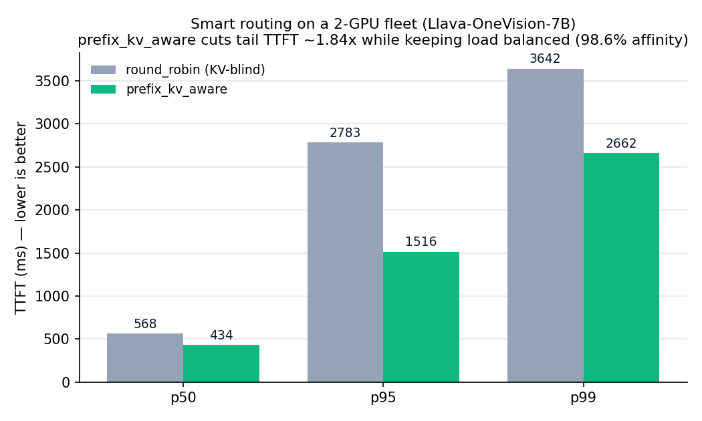
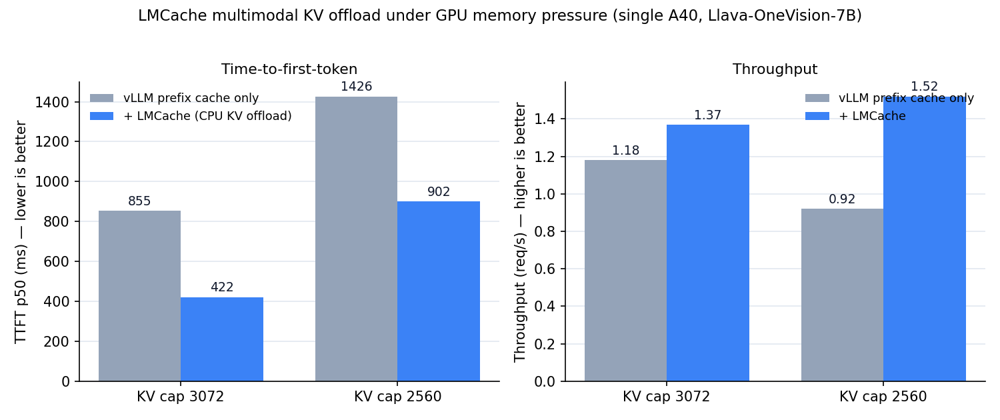

# InferGate — Benchmark Report

Honest, reproducible measurements of InferGate's two headline features on real GPUs with a
multimodal vision-language model. **No inflated numbers** — where a technique doesn't help,
we say so and explain when it does.

- **Model:** `llava-hf/llava-onevision-qwen2-7b-ov-hf` (Llava-OneVision-7B, ~6.5k vision
  tokens per 1024×1024 image)
- **Serving engine:** vLLM 0.11.0, `--enforce-eager` (removes CUDA-graph compile spikes so
  latency reflects real serving, not warmup)
- **Hardware:** RunPod — single A40 (LMCache) and 2× A40 (routing)
- **Client:** `loadtest/multimodal_bench.py` (multimodal VQA trace, real base64 images),
  percentiles over all requests; a separate different-seed warm-up precedes each measured run

---

## 1. Smart routing — `prefix_kv_aware` vs `round_robin` (2-GPU fleet)

**Setup.** Two vLLM replicas, **one per GPU**. Each replica's GPU KV cache is capped
(`--num-gpu-blocks-override 3000`) so the working set (12 distinct 1024×1024 images) cannot
all stay resident on a single replica. 120 requests, concurrency 8. The gateway routes with
`round_robin` (KV-blind baseline, D) vs `prefix_kv_aware` (E), which hashes each request's
prefix — including the image bytes — and sends it to the replica that already holds that
prefix warm, maximizing cross-replica KV reuse. A load guard (`max_inflight_skew: 2`)
prevents popular prefixes from snowballing onto one replica.



| Metric | D: round_robin | E: prefix_kv_aware | Improvement |
|---|---|---|---|
| TTFT p50 | 568 ms | **434 ms** | −24% |
| TTFT **p95** | 2,783 ms | **1,516 ms** | **1.84× lower (−45%)** |
| TTFT p99 | 3,642 ms | **2,662 ms** | −27% |
| Throughput | 2.69 req/s | **3.06 req/s** | **+14%** |
| Per-replica split | 72 / 72 | 73 / 71 | balanced (no snowball) |
| Routing-affinity hit rate | — | **98.6%** | — |

**Takeaway.** Prefix-aware routing cut tail latency nearly in half **while keeping load
balanced** across both GPUs. Round-robin scatters each image across both replicas, so each
replica keeps re-prefilling ~6.5k vision tokens on a miss; prefix-aware keeps each image's
KV resident on one replica (98.6% warm hits). The 73/71 split shows the load guard works —
affinity-first routing *without* it would pile popular images onto one GPU and regress p95.

> Earlier mock-fleet validation agreed: 99.2% affinity, balanced 59/61.
> Raw data: [`results/routing/D.json`](../results/routing/D.json),
> [`results/routing/E.json`](../results/routing/E.json).

---

## 2. LMCache multimodal KV offload under GPU memory pressure

**Setup.** Single A40, 40 distinct 1024×1024 images, 80 requests, concurrency 4. We cap the
GPU KV cache (`--num-gpu-blocks-override`) to force the working set to overflow GPU memory —
the regime CPU KV-offload exists for (this extends the AWS-internship KV-offload work).
**B** = vLLM's GPU-only prefix cache. **C** = B + LMCache 0.3.7 (multimodal-capable) offloading
KV to CPU.



| GPU KV cap | B: vLLM cache only (TTFT p50 / thr) | C: + LMCache (TTFT p50 / thr) | Gain |
|---|---|---|---|
| 3072 blocks | 855 ms / 1.18 req/s | **422 ms / 1.37 req/s** | **2.0× lower TTFT**, +16% thr |
| 2560 blocks | 1426 ms / 0.92 req/s | **902 ms / 1.52 req/s** | 1.6× lower TTFT, **+65% thr** |

**Takeaway.** Under memory pressure, vLLM's GPU prefix cache thrashes (its hit rate fell to
~41% at 2560 blocks); LMCache's CPU offload keeps the multimodal KV warm and recovers it
faster than recomputing it. **Honest framing: ~1.5–2×** — real and defensible, **not** the
inflated "3–10×" vendor claims. When the working set fits in GPU, vLLM's own cache suffices
and **C ≈ B (no gain)** — the win only appears under pressure.

> Raw data: `results/Bp.json`, `results/Cp.json` (3072 blocks);
> `results/Bp2.json`, `results/Cp2.json` (2560 blocks).

---

## 3. Reproducing

```bash
# charts (from the raw JSONs already in results/)
python scripts/make_charts.py            # -> docs/assets/{routing_ttft,lmcache_ttft}.png

# comparison tables
python scripts/compare_results.py D=results/routing/D.json E=results/routing/E.json

# the GPU runs themselves (need the RunPod env in HANDOFF.md §3):
#   routing : scripts-staged ig_route2gpu.sh (2 replicas, one per GPU, ports 19001/19002)
#   lmcache : single replica with --kv-transfer-config LMCacheConnectorV1, KV cap sweep
```

## 4. Methodology notes & caveats (read these)

- **`--enforce-eager`** on every run: otherwise the first requests eat CUDA-graph compile
  time and pollute TTFT percentiles.
- **Warm-up with a different seed** before each measured run; the server is restarted between
  configs so no state leaks.
- **Memory pressure is the whole point** of both experiments. Both LMCache and prefix-aware
  routing are about *recovering KV you'd otherwise recompute*; with infinite GPU memory and a
  small working set, neither helps — and we report that honestly.
- **`nvidia-smi` is unreliable inside RunPod containers** (PID-namespace; reports 0 MiB).
  Health was verified via vLLM `/health` and a real chat smoke test, not GPU memory readouts.
- Numbers are single-run point estimates on rented GPUs, meant to show **direction and
  magnitude**, not vendor-grade SLA figures.
